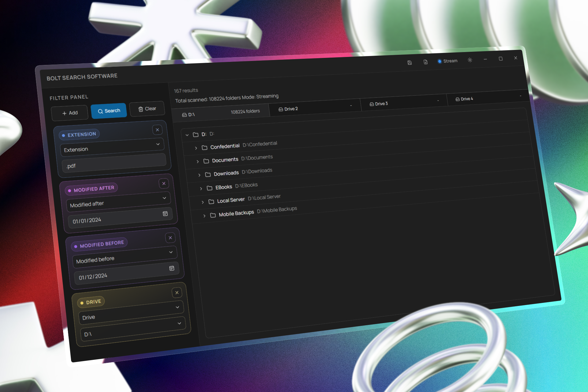

# Bolt Search User Manual

<p align="center">
	
</p>

Bolt Search is a Windows desktop app for finding files and folders quickly using filter pipelines.
This manual explains how to use the app day-to-day.

## Table of Contents

- [1) What Bolt Search Does](#1-what-bolt-search-does)
- [2) Install and Launch](#2-install-and-launch)
- [3) Interface Tour](#3-interface-tour)
- [4) Quick Start Workflow](#4-quick-start-workflow)
- [5) Filter Guide](#5-filter-guide)
- [6) Search Modes](#6-search-modes)
- [7) Save and Load Filter Profiles](#7-save-and-load-filter-profiles)
- [8) Result Tree Actions](#8-result-tree-actions)
- [9) Best Practices for Large Drives](#9-best-practices-for-large-drives)
- [10) Troubleshooting](#10-troubleshooting)

## 1) What Bolt Search Does

Bolt Search helps you:

- Search across all Windows drives or a specific drive.
- Narrow results using name, path, extension, size, and date filters.
- Scope searches to one or more picked folders.
- See results in a hierarchical tree (folder/file structure).
- Open file locations directly in Windows Explorer.
- Save and reuse filter presets with `.bsearch` files.

## 2) Install and Launch

If you are running from source:

1. Install dependencies:

```bash
bun install
```

2. Start the desktop app in development mode:

```bash
bun run tauri dev
```

3. Build a production desktop bundle:

```bash
bun run tauri build
```

## 3) Interface Tour

### Top Bar

- Save icon: save current filter setup.
- Load icon: load a saved `.bsearch` filter profile.
- Stream toggle: switch between Streaming and Batch behavior.
- Theme toggle: switch between light and dark theme.
- Window controls: minimize, maximize, close.

### Left Sidebar (Filter Panel)

- Top action row:
	- Add: add a new filter tile.
	- Search: start search (or Stop while running).
	- Clear: clear current results.
- Filter tiles:
	- Each tile has a filter type dropdown.
	- Tile color indicates filter type category.
	- Remove button deletes that filter.

### Right Panel (Results)

- Status area shows running state, scanned folders, and result count.
- Results are displayed as a collapsible tree.
- Click a file row to reveal it in Windows Explorer.

## 4) Quick Start Workflow

1. Click Add.
2. Choose a filter type (for example `name_contains` or `extension`).
3. Add a drive or subfolder scope if needed.
4. Click Search.
5. Expand folders in the result tree.
6. Click a file to open its location in Explorer.

## 5) Filter Guide

All filters are AND-combined. A result must pass every active filter.

### Scope and Path Filters

| Filter | Value | Purpose | Example |
|---|---|---|---|
| `drive` | Yes | Search one drive or all drives | `ALL`, `C:\` |
| `subfolder` | Yes | Search inside selected folder(s) | Pick folder via Browse |
| `path_contains` | Yes | Path substring match (stackable) | `projects`, `src/` |
| `path_prefix` | Yes | Path starts with prefix | `C:/Users/Ana/Documents` |

### Name and Extension Filters

| Filter | Value | Purpose | Example |
|---|---|---|---|
| `name_contains` | Yes | Match part of file/folder name | `report` |
| `extension` | Yes | File extension match (stackable) | `.pdf,.docx` |

### Size Filters

| Filter | Value | Purpose | Example |
|---|---|---|---|
| `size_gt` | Yes + unit | File/folder size must be greater than value | `10 MB` |
| `size_lt` | Yes + unit | File/folder size must be less than value | `200 MB` |

### Date Filters

| Filter | Value | Purpose | Example |
|---|---|---|---|
| `modified_after` | Yes (`YYYY-MM-DD`) | Modified later than date | `2026-01-01` |
| `modified_before` | Yes (`YYYY-MM-DD`) | Modified earlier than date | `2026-03-01` |
| `modified_range` | Yes (start + end) | Modified between two dates | `2026-01-01` to `2026-01-31` |
| `created_after` | Yes (`YYYY-MM-DD`) | Created later than date | `2026-01-01` |
| `created_before` | Yes (`YYYY-MM-DD`) | Created earlier than date | `2026-03-01` |
| `created_range` | Yes (start + end) | Created between two dates | `2026-01-01` to `2026-01-31` |

### Attribute Filters

| Filter | Value | Purpose |
|---|---|---|
| `hidden` | No | Only hidden items |
| `readonly` | No | Only read-only items |
| `file_only` | No | Exclude directories |
| `folder_only` | No | Exclude files |

### Contradictions (Search Is Blocked)

Bolt Search blocks impossible filter combinations, including:

- Duplicate non-stackable filters.
- `size_gt >= size_lt`.
- `modified_after >= modified_before`.
- `created_after >= created_before`.
- `modified_range` start date greater than end date.
- `created_range` start date greater than end date.
- `file_only` and `folder_only` both active.

## 6) Search Modes

### Streaming Mode

- Shows results progressively while scanning continues.
- Best when you want first results quickly.

### Batch Mode

- Prioritizes a complete pass and then shows full batch results.
- Useful when you want stable final sets rather than live updates.

Switch modes using the Stream toggle in the top bar.

## 7) Save and Load Filter Profiles

Use Save and Load in the top bar.

- File extension: `.bsearch`
- Recommended default name: `bolt-filter.bsearch`

Example profile payload:

```json
{
	"version": 1,
	"filters": [
		{ "type": "extension", "value": ".rs,.toml" },
		{ "type": "modified_range", "value": "2026-01-01", "value2": "2026-01-31" },
		{ "type": "drive", "value": "C:\\" },
		{ "type": "size_gt", "value": "10", "unit": "MB" }
	]
}
```

## 8) Result Tree Actions

- Expand/collapse folders using row controls.
- Click a file row to reveal it in Windows Explorer.
- Paths are displayed to help you quickly verify location context.

## 9) Best Practices for Large Drives

- Use `drive` or `subfolder` first to reduce search scope.
- Add `path_prefix` when you know the base directory.
- Combine with `name_contains` and `extension` for fast narrowing.
- Use date ranges instead of broad after/before windows.
- Keep only necessary filters to avoid over-constraining and missed matches.

## 10) Troubleshooting

### No Results

- Remove one restrictive filter at a time.
- Check contradiction warnings in the filter panel.
- Verify selected drive or folder exists and is accessible.

### Search Feels Slow

- Narrow to one drive or specific subfolder.
- Add `path_prefix` and extension/name filters early.
- Try Streaming mode for quicker time-to-first-result.

### App Does Not Launch in Dev Mode

1. Verify Tauri prerequisites (WebView2 + MSVC build tools).
2. Rebuild frontend assets:

```bash
bun run build
```

3. Restart app:

```bash
bun run tauri dev
```

## License

MIT License.

