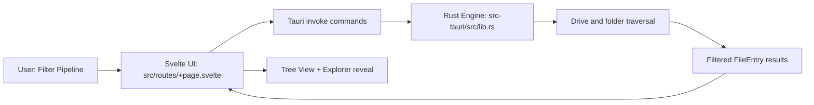

# Bolt Search

<p align="center">
	
</p>

<p align="center">
	<a href="https://tauri.app/"></a>
	<a href="https://svelte.dev/"></a>
	<a href="https://www.rust-lang.org/"></a>
	
</p>

Bolt Search is a Windows desktop file discovery app built with Tauri 2, Svelte 5, and Rust.
It provides fast progressive scanning, filter pipelines, a tree-based results view, and native desktop behaviors.

## Table of Contents

- [Why Bolt Search](#why-bolt-search)
- [Highlights](#highlights)
- [Architecture](#architecture)
- [Tech Stack](#tech-stack)
- [Getting Started](#getting-started)
- [Scripts](#scripts)
- [How to Use](#how-to-use)
- [Filter Reference](#filter-reference)
- [Saved Filter Files (.bsearch)](#saved-filter-files-bsearch)
- [Tauri Command Contract](#tauri-command-contract)
- [Project Structure](#project-structure)
- [Performance and Safety Notes](#performance-and-safety-notes)
- [Troubleshooting](#troubleshooting)
- [Roadmap](#roadmap)
- [Contributing](#contributing)
- [License](#license)

## Why Bolt Search

- Progressive UX: users get early results while deeper scanning continues.
- Powerful filtering: combine metadata, path, date, size, and visibility filters.
- Windows-first desktop behavior: frameless custom title bar, Explorer integration, and drive-aware scanning.
- Practical scaling: bounded thread pools and batched folder traversal reduce UI stalls.

## Highlights

- Drive scope filter (`ALL` or specific drive root).
- Subfolder scope filter via native folder picker.
- Two-phase progressive scan:
	- Phase 1 scans roots immediately.
	- Phase 2 scans queued subfolders in slices.
- IntelliJ-style tree results with expand/collapse and full path display.
- Top bar actions for Save/Load filter profiles.
- Filter profile persistence using custom `.bsearch` files.
- Safe Explorer reveal logic for paths containing special characters.

## Architecture

<p align="center">
	
</p>



## Tech Stack

- Desktop shell: Tauri 2
- Frontend: Svelte 5 + TypeScript + Vite + Tailwind CSS
- Backend engine: Rust 2021
- Rust crates: `walkdir`, `rayon`, `chrono`, `serde`
- Icons: `lucide-svelte`
- Native dialogs: `@tauri-apps/plugin-dialog`, `tauri-plugin-dialog`

## Getting Started

### Prerequisites

- Windows 10 or newer
- Bun (recommended package/runtime tool used by this repo)
- Rust toolchain (`stable`)
- Tauri prerequisites for Windows (WebView2 and MSVC build tools)

### Install

```bash
bun install
```

### Run in development

```bash
bun run tauri dev
```

### Build production assets

```bash
bun run build
```

### Build desktop app bundle

```bash
bun run tauri build
```

## Scripts

| Script | Description |
|---|---|
| `bun run dev` | Start Vite dev server |
| `bun run build` | Build web frontend |
| `bun run preview` | Preview built frontend |
| `bun run check` | Type and Svelte checks |
| `bun run check:watch` | Continuous checks |
| `bun run tauri dev` | Run desktop app in dev mode |
| `bun run tauri build` | Build distributable desktop bundle |

## How to Use

1. Add one or more filters from the left sidebar.
2. Choose drive scope (`ALL` or one drive) or select one or more subfolders.
3. Click Search to begin progressive scanning.
4. Expand directories in the right tree panel.
5. Click a file row to reveal it in Windows Explorer.
6. Use top bar Save/Load actions to persist filter profiles.

## Filter Reference

| Filter Type | Needs Value | Notes |
|---|---|---|
| `extension` | Yes | Comma-separated, normalized to `.ext` |
| `name_contains` | Yes | Case-insensitive substring match |
| `path_contains` | Yes | Stackable, case-insensitive path substring |
| `subfolder` | Yes | Uses native folder picker; overrides drive scope |
| `size_gt` | Yes | Size threshold with unit (`B`, `KB`, `MB`, `GB`) |
| `size_lt` | Yes | Size upper bound |
| `modified_after` | Yes | `YYYY-MM-DD` |
| `modified_before` | Yes | `YYYY-MM-DD` |
| `created_after` | Yes | `YYYY-MM-DD` |
| `created_before` | Yes | `YYYY-MM-DD` |
| `drive` | Yes | `ALL` or specific root like `C:\` |
| `hidden` | No | Windows hidden attribute required |
| `readonly` | No | Read-only file permission required |
| `file_only` | No | Exclude directories |
| `folder_only` | No | Exclude files |

Filter contradiction checks currently block impossible combinations, including:

- repeated non-stackable filters,
- `size_gt >= size_lt`,
- `modified_after >= modified_before`,
- `created_after >= created_before`,
- both `file_only` and `folder_only` together.

## Saved Filter Files (.bsearch)

Bolt Search supports filter profile persistence through custom `.bsearch` files.

- Save dialog default file name: `bolt-filter.bsearch`
- Load dialog filter: `*.bsearch`
- File content: versioned JSON payload

Example payload:

```json
{
	"version": 1,
	"filters": [
		{ "type": "extension", "value": ".rs,.toml" },
		{ "type": "drive", "value": "C:\\" },
		{ "type": "size_gt", "value": "10", "unit": "MB" }
	]
}
```

## Tauri Command Contract

| Command | Purpose | Return |
|---|---|---|
| `search(query)` | Full recursive search entry point | `Result<Vec<FileEntry>, String>` |
| `list_search_roots()` | Enumerate available drive roots | `Vec<String>` |
| `list_subfolders(root)` | List first-level subfolders under root | `Result<Vec<String>, String>` |
| `search_in_root(query, root, limit)` | Legacy progressive root scan helper | `Result<Vec<FileEntry>, String>` |
| `search_folder_batch(query, folders, limit, thread_limit)` | Non-recursive parallel batch scan | `Result<FolderBatchResult, String>` |
| `open_in_explorer(path)` | Open/reveal path in Windows Explorer | `Result<(), String>` |
| `save_filter_file(path, content)` | Write `.bsearch` file to disk | `Result<(), String>` |
| `load_filter_file(path)` | Read filter file from disk | `Result<String, String>` |

## Project Structure

```text
bolt-search/
|- src/
|  |- routes/
|     |- +layout.svelte        # custom title bar + topbar actions
|     |- +page.svelte          # filters, search orchestration, tree UI
|     |- filter.svelte.ts      # filter model and serialization
|- src-tauri/
|  |- src/
|     |- main.rs               # thin entry point
|     |- lib.rs                # search/filter engine + command handlers
|  |- capabilities/
|     |- default.json          # window/api permissions
|  |- tauri.conf.json          # window and build configuration
```

## Performance and Safety Notes

- Two-phase search reduces time-to-first-result.
- Batch traversal uses bounded concurrency with configurable thread limits.
- Thread pool instances are cached by worker count to reduce setup overhead.
- Size parsing uses overflow-safe multiplication (`checked_mul`).
- Date comparisons run on signed Unix timestamps (`i64`).
- Command-level panic guards are used on key search commands.
- Explorer path handling canonicalizes and passes args safely to avoid misrouting.

## Troubleshooting

### App exits early in dev mode

If `bun run tauri dev` exits unexpectedly before UI interaction:

1. Ensure Windows build tools and WebView2 runtime are installed.
2. Run `bun run build` to confirm frontend output integrity.
3. Re-run with logs enabled:

```bash
bun run tauri dev -- --verbose
```

4. Inspect backend startup path in `src-tauri/src/main.rs` and `src-tauri/src/lib.rs`.

### No search results

- Verify selected drive or subfolder exists and is accessible.
- Check contradiction warnings in the filter panel.
- Remove restrictive filters like `hidden`, `readonly`, and narrow date/size ranges.

## Roadmap

- Add packaged release notes and auto-update flow.
- Add optional indexing/cache mode for very large file systems.
- Add richer export options for result sets.
- Add automated integration tests for command contracts.

## Contributing

Contributions are welcome.

1. Fork the repo.
2. Create a feature branch.
3. Keep changes focused and documented.
4. Run checks before opening a PR:

```bash
bun run check
bun run build
```

5. Open a pull request with clear rationale and screenshots/logs when relevant.

## License

MIT License. See project metadata in `package.json`.

